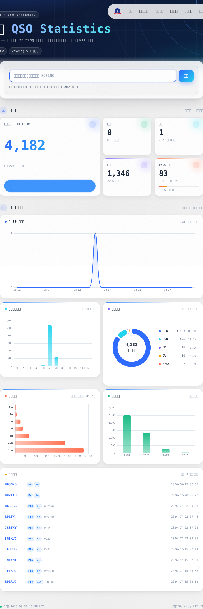
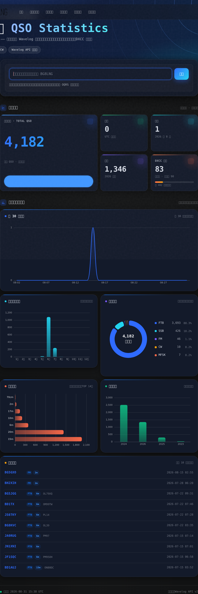
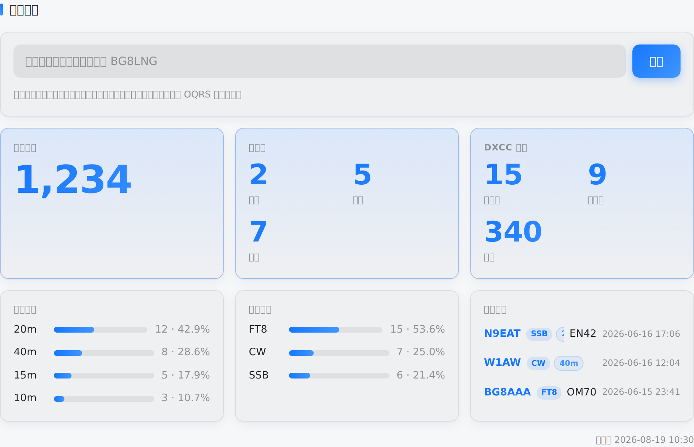
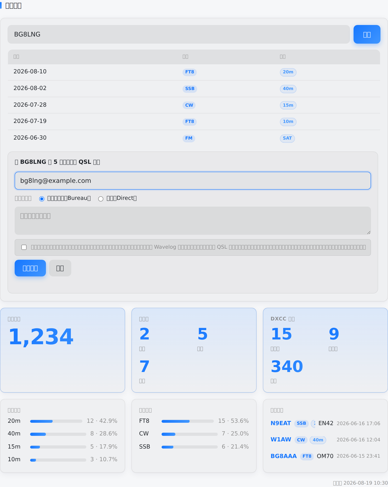

# 通联统计（QsoStats）


一个 Halo 2.x 插件：通过 [Wavelog](https://www.wavelog.org) 日志平台的 API v2，在个人网站上展示业余无线电通联统计（QSO 总数、DXCC 字头、波段/模式分布、最近通联、活跃度等），并支持**按呼号查询通联记录**与**一键 OQRS 卡片申请**。

- 🌐 **在线演示**：<https://bg8lng.com/qso-stats>
- 📦 **源码仓库**：<https://github.com/bg8lng/halo-plugin-qso-stats>
- 📥 **版本下载**：<https://github.com/bg8lng/halo-plugin-qso-stats/releases>
- 🔒 **隐私说明**：[PRIVACY.md](PRIVACY.md)
- 📝 **更新日志**：[CHANGELOG.md](CHANGELOG.md)

> 🆕 **v1.6.1**：修复访客提交 OQRS 被 Halo CSRF 拒为 403 的问题（新增 `GET /qso-stats/api/csrf` 令牌端点，前端自动携带）。
> **v1.6.0**：公开接口访问控制与防滥用强化（开关关闭时服务端拒绝、OQRS 服务端记录校验 / 频率限制 / 防重复提交）、补充完整隐私与第三方数据处理说明、Java 包名迁移至 `com.bg8lng.qsostats`。详见 [CHANGELOG](CHANGELOG.md)。

## 功能一览

| 统计项目 | 类型 | 说明 |
| --- | --- | --- |
| 通联总数 | 大数字 | Wavelog `statistic.qso.total` |
| 活跃度 | 三个指标 | 今日 / 本月 / 今年通联数 |
| DXCC 字头 | 三个指标 | 已通联 / 已确认 / 可用字头数 |
| 波段分布 | 条形分布 | 各波段通联占比（可设条数） |
| 模式分布 | 条形分布 | 各模式通联占比（可设条数） |
| 日 / 月 / 历年统计 | 图表 | 近 30 日通联、本年每月通联、历年通联（ECharts，独立统计页） |
| 模式 / 频段分布 | 图表 | 模式占比环图、频段横向条形图 + 排名列表（独立统计页） |
| 最近通联 | 列表 | 最近 N 条通联（呼号 / 波段 / 模式 / 时间） |
| 呼号查询 | 搜索框 | 按呼号检索通联，展示日期 / 模式 / 频段（可关闭） |
| 一键 OQRS | 按钮 | 对查询结果一键提交 QSL 卡片申请（邮箱必填、需勾选数据处理告知，可单独关闭） |

## 界面预览

| 独立统计页 · 浅色 | 独立统计页 · 深色 |
| --- | --- |
|  |  |

| 嵌入式统计组件 | 呼号查询 + OQRS 申请（含数据处理告知） |
| --- | --- |
|  |  |

> 截图源文件位于 [docs/screenshots](docs/screenshots)。
> 仪表盘截图取自在线演示站 <https://bg8lng.com/qso-stats>；
> 组件与 OQRS 截图取自本仓库 `demo/preview.html`（模拟数据，可本地复现，见 [docs/REVIEW-GUIDE.md](docs/REVIEW-GUIDE.md)）。

## 安装

### 方式一：直接安装（推荐）

在 [Releases](https://github.com/bg8lng/halo-plugin-qso-stats/releases) 下载最新的 `qso-stats-1.6.1.jar`，
在 Halo 后台「插件」→「安装」→ 上传并启用。

### 方式二：本地构建

```bash
# 需要 JDK 17+
git clone https://github.com/bg8lng/halo-plugin-qso-stats.git
cd halo-plugin-qso-stats
./gradlew build
# 产物：build/libs/qso-stats-1.6.1.jar
```

## 前置准备：Wavelog API Token

1. 登录 Wavelog，进入用户菜单的 **API** 页面；
2. 创建 **API v2 Token**（`wl2_` 开头），权限**仅**勾选：
   - `statistic:read`（统计接口）
   - `qso:read`（最近通联 / 呼号查询）
3. 复制完整 Token（只显示一次，请立即保存）。

> 要求 Wavelog ≥ 3.1.0（API v2 的最低版本）。请遵循最小权限原则，不要授予写权限。

## 后台配置

启用插件后，进入「插件」→「通联统计」→「设置」：

### ① Wavelog API 配置

| 项 | 说明 |
| --- | --- |
| Wavelog 站点地址 | 如 `https://log.example.com`（可带 `/index.php`，插件自动拼接） |
| API Token | 上一步创建的 `wl2_...` Token（密码类型字段） |
| 缓存时间 | Wavelog 数据缓存秒数，默认 300 |
| 请求超时 | 默认 10 秒 |
| 统计页面标题 | `/qso-stats` 页面的标题 |

### ② 统计项目

列表可增删、拖拽排序、启停；每项可改「显示标题」；波段/模式/最近通联可设「显示条数」。

### ③ 展示与交互

| 项 | 说明 |
| --- | --- |
| 数据展示样式 | 现代仪表盘（Bento）/ 经典卡片 |
| 默认主题 | 跟随站点主题色 / 浅色 / 深色 |
| **启用呼号查询与 OQRS** | **总开关**。关闭后前台不显示查询框，且服务端直接拒绝两个公开接口（HTTP 403） |
| **启用一键 OQRS 卡片申请** | 单独关闭写操作，仅保留只读查询；关闭后服务端拒绝所有 OQRS 提交 |
| 查询结果上限 | 呼号查询最多返回的条数（默认 50） |
| 区块标题 / 更新时间 / 失败文案 | 展示细节 |

### ④ 访问控制与防滥用

| 项 | 默认值 | 说明 |
| --- | --- | --- |
| 呼号查询频率上限 | 20 次 / 分钟 / IP | 超出返回 HTTP 429 |
| OQRS 提交频率上限 | 5 次 / 小时 / IP | 超出返回 HTTP 429 |
| 单次申请最多通联条数 | 50 | 超出返回 HTTP 400 |
| 重复提交拦截窗口 | 24 小时 | 相同内容重复提交返回 HTTP 409 |

### ⑤ 统计页面布局

面板顺序与显隐：搜索、KPI、日/月/历年、模式/频段、最近通联，可拖拽排序、停用；
图表面板可选半行（并排）或整行。

## 公开接口与访问控制

插件对外暴露 4 个无需认证的前台端点。**所有访问控制均在服务端完成**，
前端隐藏只是附加体验，直接调用接口不会绕过任何限制。

| 方法 | 路径 | 开关 | 防滥用措施 |
| --- | --- | --- | --- |
| GET | `/qso-stats/api/statistics` | 始终可用（只读聚合统计） | 服务端缓存（默认 300s） |
| GET | `/qso-stats/api/dashboard` | 始终可用（只读聚合统计） | 服务端缓存（默认 300s） |
| GET | `/qso-stats/api/search` | 「启用呼号查询与 OQRS」 | 关闭 → 403；呼号格式校验 → 400；频率限制 → 429 |
| GET | `/qso-stats/api/csrf` | 始终可用（只读） | 仅下发当前会话的 CSRF 令牌，跨源无法读取响应 |
| POST | `/qso-stats/api/oqrs` | 「启用呼号查询与 OQRS」+「启用一键 OQRS 卡片申请」 | 关闭 → 403；频率限制 → 429；参数/记录校验 → 400；重复提交 → 409；请求体上限 64 KB |

### OQRS 写操作的服务端校验链

`POST /qso-stats/api/oqrs` 是本插件**唯一的公开写操作**，会把访客邮箱与留言转发到
站长自建的 Wavelog 站点，因此在转发前依次执行：

1. **功能开关**：总开关或 OQRS 开关任一关闭 → 403，不做任何后续处理；
2. **频率限制**：按客户端 IP 的固定窗口计数（默认 5 次 / 小时）→ 超限 403… 返回 429；
3. **参数校验**：呼号格式（正则）、邮箱格式与长度（≤128）、留言长度（≤500）、
   寄送方式白名单（B/D）、单次条数上限；
4. **记录校验**：**逐条比对本站 Wavelog 日志**，提交的每一条通联（日期+时间+频段+模式+电台位置）
   都必须真实存在于该呼号名下，否则整单拒绝 → 400。**前端提交的记录一律不被信任**；
5. **防重复提交**：对「呼号 + 邮箱 + 寄送方式 + 通联集合」计算 SHA-256 指纹，
   去重窗口（默认 24h）内重复提交 → 409；转发失败时释放指纹，允许访客修正后重试；
6. 通过以上全部校验后，才转发到 Wavelog 的公开申请端点。

> **客户端识别**：限流按 `X-Forwarded-For` 首段 → `X-Real-IP` → 连接远端地址 取值。
> 若 Halo 部署在 Nginx / Caddy 之后，请确保反向代理正确透传这两个头部，否则所有访客会共用同一计数桶。

## 隐私与第三方数据处理说明

**简述**：插件默认只做只读统计展示，不收集任何个人信息。仅当站长开启「一键 OQRS 卡片申请」
且访客主动提交表单时，插件才会把**访客邮箱、留言与所选通联记录**转发到**站长自己配置的
Wavelog 站点**，用于处理这一次 QSL 卡片申请。

| 维度 | 说明 |
| --- | --- |
| **接收方** | 仅站长在插件设置中填写的 Wavelog 站点（通常为站长自建）。**不会**发送给插件作者、Halo 官方或任何第三方统计/广告服务 |
| **用途** | 生成统计图表（只读）；处理 QSL 卡片申请（OQRS） |
| **保存方式** | 插件侧全部在**进程内存**中：Wavelog 数据缓存、限流计数、重复提交指纹（SHA-256，不可还原）。**不落盘、不建表、不写日志**；访客邮箱与留言仅在单次请求中透传，插件不保存 |
| **保存期限** | 缓存按设置的缓存时间过期（默认 300 秒）；限流计数 1 分钟 / 1 小时；去重指纹默认 24 小时；Halo 重启即全部清空。提交到 Wavelog 的申请由**站长**在 Wavelog 后台管理与删除 |
| **关闭方式** | 关闭「启用一键 OQRS 卡片申请」→ 停止一切访客数据外发；关闭「启用呼号查询与 OQRS」→ 同时停止查询；停用/卸载插件 → 全部下线。**关闭在服务端生效，直接调用接口同样 403** |
| **删除方式** | 访客：通过本站联系方式联系站长，由站长在 Wavelog 后台删除对应申请；内存中的计数与指纹自动过期，无需人工清理 |
| **Cookie / 跟踪** | 不使用 Cookie，不做用户画像与跨站跟踪；ECharts 随插件本地分发，不加载任何 CDN 或第三方脚本 |

前台 OQRS 表单内置**数据处理告知与勾选确认**，访客未勾选无法提交。

📄 **完整说明请阅读 [PRIVACY.md](PRIVACY.md)**（含站长合规义务与逐项数据清单）。

## 前端接入

### 方式 A：嵌入任意主题页面（推荐）

统计组件资源（JS/CSS）由插件自动注入所有主题页面，只需在目标位置放一个容器：

```html
<div class="qso-stats-widget"></div>
```

- 在「文章 / 独立页面」正文中：切到 HTML 源码模式粘贴即可；
- 在主题模板中：直接写在模板文件里，或使用插件片段：

```html
<div th:insert="~{plugin:QsoStats:fragments/qso-stats :: qso-stats-widget}"></div>
```

容器可选属性：

| 属性 | 说明 |
| --- | --- |
| `data-endpoint` | 覆盖数据接口地址（默认 `/qso-stats/api/statistics`） |
| `data-search-endpoint` | 覆盖呼号查询接口（默认 `/qso-stats/api/search`） |
| `data-oqrs-endpoint` | 覆盖 OQRS 申请接口（默认 `/qso-stats/api/oqrs`） |
| `data-csrf-endpoint` | 覆盖 CSRF 令牌接口（默认 `/qso-stats/api/csrf`） |
| `data-refresh` | 自动刷新间隔（秒，≥ 30 生效，默认关闭） |

### 方式 B：独立统计页面

直接访问 `/qso-stats`：

- **Halo ≥ 2.26**：页面复用当前主题布局（主题提供 `templates/layout.html` 时完整套用主题页头页脚）；
- **Halo < 2.26**：使用插件自带页面外壳（样式与组件一致）。

> 独立页面上组件的内嵌「区块标题」会自动隐藏，避免与页面标题形成「双重标题」。
> 主题可通过提供同名模板 `qso-stats.html` 完全接管该页面。

## 主题定制

组件全部样式通过 CSS 变量控制（均带中性兜底值，默认与主题字体颜色一致）：

```css
.qso-stats-widget {
  --qso-stats-accent: #1677ff;          /* 强调色（数值、进度条、按钮） */
  --qso-stats-accent-2: #4096ff;        /* 强调色渐变终点 */
  --qso-stats-card-bg: rgba(127,127,127,.06);     /* 卡片背景 */
  --qso-stats-card-border: rgba(127,127,127,.16); /* 卡片边框 */
  --qso-stats-card-shadow: 0 1px 2px rgba(16,24,40,.05), 0 4px 16px rgba(16,24,40,.04);
  --qso-stats-radius: 14px;             /* 圆角 */
  --qso-stats-muted: rgba(127,127,127,.85);       /* 次要文字 */
  --qso-stats-track: rgba(127,127,127,.16);       /* 进度条轨道 / 悬停背景 */
  --qso-stats-danger: #dc2626;          /* 错误提示色 */
  --qso-stats-success: #16a34a;         /* 成功提示色 */
}
```

## 常见问题

**Q：页面显示「未配置 Wavelog API 地址或 Token」**
插件设置中填写 Wavelog 站点地址和 `wl2_` Token 后保存即可。

**Q：接口返回 401 / 403（Wavelog 侧）**
Token 无效、过期或缺少权限。请确认 Token 以 `wl2_` 开头、未过期，且勾选了 `statistic:read` 与 `qso:read`。

**Q：查询接口返回 403 / 429**
403 表示后台已关闭「启用呼号查询与 OQRS」；429 表示触发了频率限制，可在「访问控制与防滥用」中调整。

**Q：OQRS 提交返回 400「提交的通联记录与本站日志不一致」**
服务端会逐条校验提交的通联是否真实存在于本站日志。请重新查询后再申请（查询结果可能已过期）。

**Q：OQRS 提交返回 409**
相同内容在去重窗口内已提交过。如需修改申请，请联系站长，或等待窗口过期。

**Q：修改设置后数据没变化**
统计接口结果有缓存（默认 300 秒），可在设置中调低「缓存时间」。

**Q：一键 OQRS 提交返回 403 且响应是纯文本 `Access Denied`**
这是 Halo 的 CSRF 保护拒绝了请求（不是插件返回的，插件的 403 一定是 JSON）。
v1.6.1 起前端会自动通过 `GET /qso-stats/api/csrf` 获取并携带令牌；若仍出现，
请确认该端点可正常访问（升级后记得刷新浏览器与 CDN 缓存）。

**Q：一键 OQRS 提交失败（502）**
请确认 Wavelog 站点已为该电台位置开启 OQRS 且设置了公开 slug；另外，若 Wavelog 管理员开启了 CSRF 防护，公开申请端点会拒绝插件转发的请求（Wavelog 默认关闭 CSRF）。

**Q：/qso-stats 页面没有主题页头页脚**
Halo < 2.26 时布局契约不可用，会使用自带外壳；升级 Halo 或改用「方式 A」嵌入。

## 本地预览

无需 Halo 环境即可查看组件效果（使用模拟数据，含亮/暗主题两种示例）：

```bash
cd halo-plugin-qso-stats
python3 -m http.server 8080
# 浏览器打开 http://localhost:8080/demo/preview.html
```

## 开发

```bash
./gradlew build        # 构建 + 运行单元测试
./gradlew test         # 仅测试
```

- 后端：Java 17 / Spring WebFlux，包名 `com.bg8lng.qsostats`（`src/main/java`）
- 设置表单：`src/main/resources/extensions/settings.yaml`
- 组件样式/脚本：`src/main/resources/static/`
- 页面模板：`src/main/resources/templates/`
- 单元测试：`src/test/java`（含访问控制、限流、记录校验、防重复提交用例）

审核与自测的完整功能路径见 [docs/REVIEW-GUIDE.md](docs/REVIEW-GUIDE.md)。

## 许可证

本项目采用 **[GPL-3.0](LICENSE)** 开源许可证。

- SPDX 标识：`GPL-3.0-only`
- 许可证全文：[LICENSE](LICENSE) · <https://www.gnu.org/licenses/gpl-3.0.html>
- 版权所有 © 2026 BG8LNG

第三方组件：[Apache ECharts](https://echarts.apache.org/)（Apache-2.0，随插件本地分发，见 `src/main/resources/static/echarts.min.js`）。
